# 🗺️ Semantic Code Graph (Graft AST Map): SmartphoneMonitor
**Stack:** C# / WPF .NET
**Generated:** Auto-synced for Zero-Cost AI Agent Navigation

## ⚡ Core Pipeline Flows (Архитектурные цепочки вызовов)

```mermaid
graph LR
    Services_DataAnalysisService_cs["Services/DataAnalysisService.cs"] -->|classifies incoming ads| Services_ListingClassifier_cs["Services/ListingClassifier.cs"]
    Services_ListingClassifier_cs["Services/ListingClassifier.cs"] -->|verifies defect and scam markers| Services_AntiScamService_cs["Services/AntiScamService.cs"]
    Services_AntiScamService_cs["Services/AntiScamService.cs"] -->|evaluates profit and builds hot deals| Services_HotDealBuilder_cs["Services/HotDealBuilder.cs"]
    Services_HotDealBuilder_cs["Services/HotDealBuilder.cs"] -->|produces quant verdict| Models_QuantVerdict_cs["Models/QuantVerdict.cs"]
    MainWindow_xaml_cs["MainWindow.xaml.cs"] -->|orchestrates UI pipeline| Services_DataAnalysisService_cs["Services/DataAnalysisService.cs"]
```

## 📦 Индексированные Модули и Узлы (Nodes)
| Файл / Модуль | Тип | Ключевые методы / Эндпоинты |
| :--- | :--- | :--- |
| `App.xaml` | XAML Layout | - |
| `App.xaml.cs` | C# Source | StartPythonService, StopPythonService |
| `MainWindow.xaml` | XAML Layout | - |
| `MainWindow.xaml.cs` | C# Source | - |
| `Converters/Converters.cs` | C# Source | Convert, ConvertBack, Convert, ConvertBack |
| `Models/AnalysisResult.cs` | C# Source | - |
| `Models/BlacklistEntry.cs` | C# Source | - |
| `Models/BlacklistLoginEntry.cs` | C# Source | - |
| `Models/BrandStat.cs` | C# Source | - |
| `Models/ChronicSeller.cs` | C# Source | - |
| `Models/Constants.cs` | C# Source | - |
| `Models/DemandArbitrageDeal.cs` | C# Source | - |
| `Models/DemandListing.cs` | C# Source | - |
| `Models/HotDeal.cs` | C# Source | - |
| `Models/Listing.cs` | C# Source | - |
| `Models/LlmAnalysisResponse.cs` | C# Source | - |
| `Models/QuantVerdict.cs` | C# Source | - |
| `Models/RetailPromoPrice.cs` | C# Source | - |
| `Models/ViewsBucket.cs` | C# Source | - |
| `Services/AIVisionService.cs` | C# Source | AnalyzeImagesAsync |
| `Services/AnalysisAgent.cs` | C# Source | - |
| `Services/AntiScamService.cs` | C# Source | BuildCosTable, BuildAlphaTable, ComputeHash, HammingDistance |
| `Services/BrandSpikeAgent.cs` | C# Source | - |
| `Services/CharmPricingService.cs` | C# Source | ApplyCharmPricing |
| `Services/ChronicSellerService.cs` | C# Source | Detect |
| `Services/ClassificationService.cs` | C# Source | Classify |
| `Services/DataAnalysisService.cs` | C# Source | Analyze, ExtractBatteryHealth |
| `Services/DatabaseService.cs` | C# Source | InitializeDatabase, GetBlacklist, AddBlacklist, RemoveBlacklist |
| `Services/ExchangeRateService.cs` | C# Source | GetEurToMdlRateAsync |
| `Services/HotDealBuilder.cs` | C# Source | Create, IsHotDeal |
| `Services/ListingClassifier.cs` | C# Source | NormalizePhone, IsAccessoryOrPartOrOther, IsBuyAd, IsFeatureOrRetroPhone |
| `Services/ListingEvaluationService.cs` | C# Source | GetBestPromo, EvaluateScore, ApplyComparisonText, FindBestPromo |
| `Services/MatchingClientService.cs` | C# Source | Reset |
| `Services/MetricsRepository.cs` | C# Source | EnsureDatabase, InsertMetric |
| `Services/MetricsService.cs` | C# Source | Increment, GetCounterValue, SetGauge, ObserveHistogram |
| `Services/ModelParserService.cs` | C# Source | ExtractModel, CleanNormalizedModel |
| `Services/ModelPriceBaselineService.cs` | C# Source | GetBaseline, EstimateDeviceAgeYears |
| `Services/NotificationAgent.cs` | C# Source | - |
| `Services/PriceAnalysisService.cs` | C# Source | Analyze, BuildPriceTrends, BuildPriceBuckets, ClassifyOutlier |
| `Services/PromoKeyHelper.cs` | C# Source | SanitizeKey, SanitizePrefix, NormalizeToken |
| `Services/PromoSyncAgent.cs` | C# Source | - |
| `Services/QuantSniperEngine.cs` | C# Source | CalculateFairValue, Evaluate, GetBrandLiquidityWeight |
| `Services/RetailPromoService.cs` | C# Source | InvalidateCache, AddToMap, LoadRetailPromoPrices |
| `Services/RetryFailedNotificationsAgent.cs` | C# Source | - |
| `Services/ScraperAgent.cs` | C# Source | - |
| `Services/TelegramNotificationService.cs` | C# Source | SendTestMessageAsync, SendTextMessageAsync, SendHotDealNotificationAsync, SendListingAlertAsync |
| `Services/WebScraperService.cs` | C# Source | CreateDefaultHttpClientFactory, ScrapeSmartphonesAsync, FetchListingImagesAsync, FetchListingsGraphQLAsync |
| `Services/XiaomiOsSupportService.cs` | C# Source | LoadPolicyFromFile, AnalyzeModel |
| `Tests/ModelPriceBaselineTests.cs` | C# Source | Redmi9_ReturnsRealisticBaselinePrice, GalaxyA12_ReturnsRealisticBaselinePrice |
| `Tests/PromoMatchingTests.cs` | C# Source | Run |
| `Tests/PromoMatchingUnitTests.cs` | C# Source | FindsExactPromo_ByStorage, FindsGeneralPromo_WithoutStorage, FindsBrandFallback_WhenNoModelMatch |
| `Tests/PromoScoringUnitTests.cs` | C# Source | EvaluateScore_ReflectsPromoComparison_ForNewListing |
| `ViewModels/MainViewModel.cs` | C# Source | OnBlacklistRequested, OnBlacklistLoginRequested, CancelScan, LoadSavedSettings |
| `ViewModels/RelayCommand.cs` | C# Source | CanExecute, Execute, Raise, CanExecute |
| `Views/NotificationWindow.cs` | C# Source | RearrangeWindows |
| `Views/PriceAnalysisWindow.cs` | C# Source | CreateStatBox |
