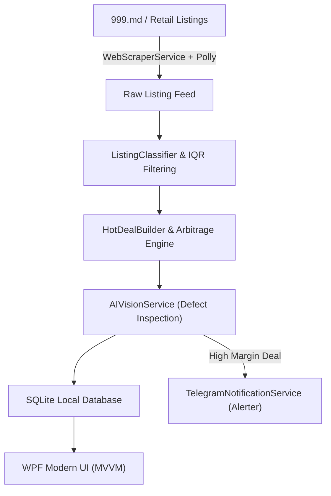

# SmartphoneMonitor 📱📊⚡
> **Intelligent Desktop Market Scanner, Demand Arbitrage Engine & AI Vision Defect Detector for Smartphones (.NET 8 / WPF / SQLite)**

[](https://opensource.org/licenses/MIT)
[](https://dotnet.microsoft.com/)
[](https://learn.microsoft.com/en-us/dotnet/desktop/wpf/)
[](https://www.sqlite.org/)
[](https://github.com/vovamalina19742-ru/SmartphoneMonitor)

---

## 🌟 Key Features

### 1. 🔍 High-Throughput Market Scraping (Polly Resilience)
- Asynchronous multi-page crawling with exponential backoff and jitter via **Microsoft Polly**.
- Automatic extraction of smartphone brand, model name, storage size, RAM, price, seller rating, and photos.

### 2. 🔥 Hot Deals & Arbitrage Scoring (v2 Algorithm)
- **IQR Outlier Filtering:** Detects genuine discounts while eliminating fake listings and defect-damaged pricing anomalies.
- **Demand Arbitrage Deals:** Matches active second-hand supply against retail market baseline prices to calculate net resell margins.
- **Repair Cost Estimator:** Estimates glass/battery repair costs and factors them into ROI calculations.

### 3. 🤖 AI Vision Defect Classifier
- Analyzes uploaded listing photos using computer vision.
- Identifies cracked screens, back glass damage, missing accessories, and casing wear.

### 4. 📬 Real-Time Telegram Alerts
- Background notification daemon with long-polling feedback loops.
- Instant rich alerts with device specs, photos, direct links, and discount score badges sent to your phone.

### 5. 🗄️ Local-First SQLite Storage & Blacklists
- Tracks historical price dynamics over time.
- Integrated seller blacklist and chronic dealer tracking to prevent spam.

---

## 🏗️ Architecture



---

## 🚀 Quick Start

### Prerequisites
- [.NET 8.0 SDK](https://dotnet.microsoft.com/download/dotnet/8.0) (Windows x64)

### Build & Run
```bash
git clone https://github.com/vovamalina19742-ru/SmartphoneMonitor.git
cd SmartphoneMonitor
dotnet restore
dotnet build -c Release
dotnet run --project SmartphoneMonitor.csproj
```

---

## ⚙️ Configuration (`appsettings.json`)

To enable Telegram alerts and AI vision features, configure `appsettings.json`:

```json
{
  "Telegram": {
    "Token": "YOUR_TELEGRAM_BOT_TOKEN",
    "ChatId": "YOUR_TELEGRAM_CHAT_ID",
    "Enabled": true
  },
  "Gemini": {
    "ApiKey": "YOUR_GEMINI_API_KEY"
  }
}
```

---

## ⚖️ License

Distributed under the **MIT License**. See `LICENSE` for more information.
